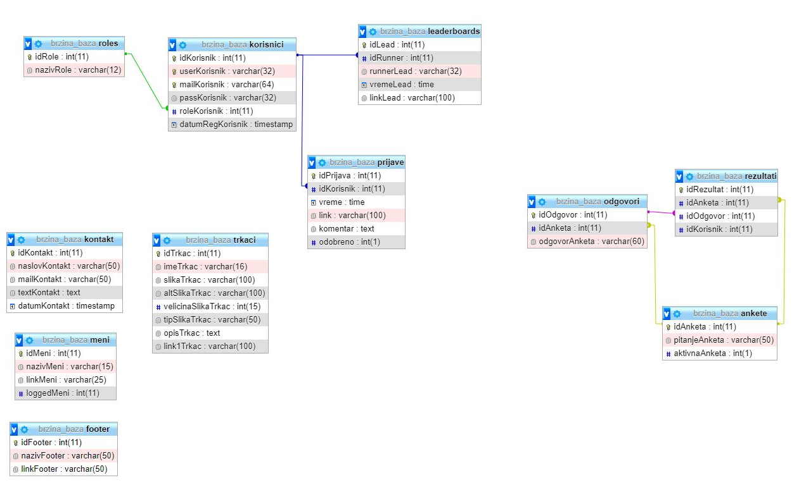

## Brzina moja Vrlina

Web site made using PHP, HTML, CSS, Bootstrap, JavaScript, jQuery, SQL

## Project Specification

- Login and register pages for users
- Leaderboards page with search and sort functions
- Runners page that works like a gallery
- Submissions page for signed in users to submit their time to the leaderboards
- Contact page where everyone can send a message to the administrators
- Survey page for signed in users that shows active surveys and lets users vote only if they didn't vote already
- Profile page for signed in users, user can see their submissions and their status
- Admin panel
    - Only visible to admins
    - Table where all registered users are shown with edit and delete functions
    - Form for adding a new user
    - Table for seeing all submissions and buttons for accepting and declining them
    - Table to see all data in leaderboards and an option to delete
    - Contact table to see all data sent from the contact page and a delete button for each message
    - Survey table to see all surveys, button to activate and deactivate them
    - Table that shows results from the surveys
    - Runner table that shows data for each runner, buttons for deleting and editing
    - Button for inserting a new runner with image uploading function
- Connection to the mySql database
- Every form submit gets checked on the client side and server side for validity

## Database

- Database made in mySql

## Notes

- Need to insert your own database credentials in `konekcija.php`